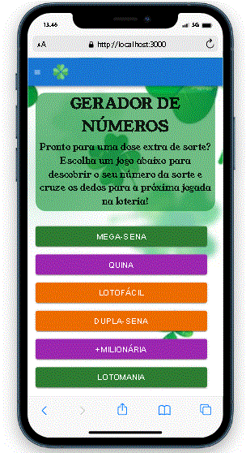

# PROJETO GERADOR DE NÚMEROS LOTARIA.

Um gerador de números aleatórios para os principais jogos da lotaria Caixa.

## Índice

- <a href="#funcionalidades">Funcionalidades do projeto</a>

- <a href="layout">Layout</a>

- <a href="demonstracao">Demonstração</a>

- <a href="rodar">Como rodar esse projeto?<a>

- <a href="#tecnologias">Tecnologias atilizadas</a>

- <a href="Autor">Autor</a>

## 🕹️ Funcionalidades do Projeto

- [x] Números Aleatórios.

- [x] Cada botão tem como objetivo representar um jogo.

- [x] Uma página que explica ao usuário como e em quais dias ele pode jogar.

## 🖥️ Layout




## ⭐ Demonstração
[Link demonstração](https://projeto-numeros-loteria.vercel.app/)

## 📀 Como rodar esse projeto ?


```bash
# Clone esse repositório
$  git clone linkrepo

# Acesse a pasta do projeto no seu terminal
$ cd projetosena

#Instale as dependências
$ npm install

#Execute a aplicação
$ npm run start

# A aplicação será iniciada na porta 3000, acesse pelo navegador: http://localhost:3000
```

## 💫 Tecnologias utilizadas 

1. [React](https://react.dev/)
2. [React Router](https://reactrouter.com/en/main)
3. [Material UI](https://mui.com/)
4. [Styled Components](https://styled-components.com/)
5. [npm (Node Package Manager)](https://docs.npmjs.com/)
6. [Node.js](https://nodejs.org/docs/) 

## 👨‍🎨 Autor 

RICARDO MALTA

[Linkedin](https://www.linkedin.com/in/ricardo-malta-632b70164/)


